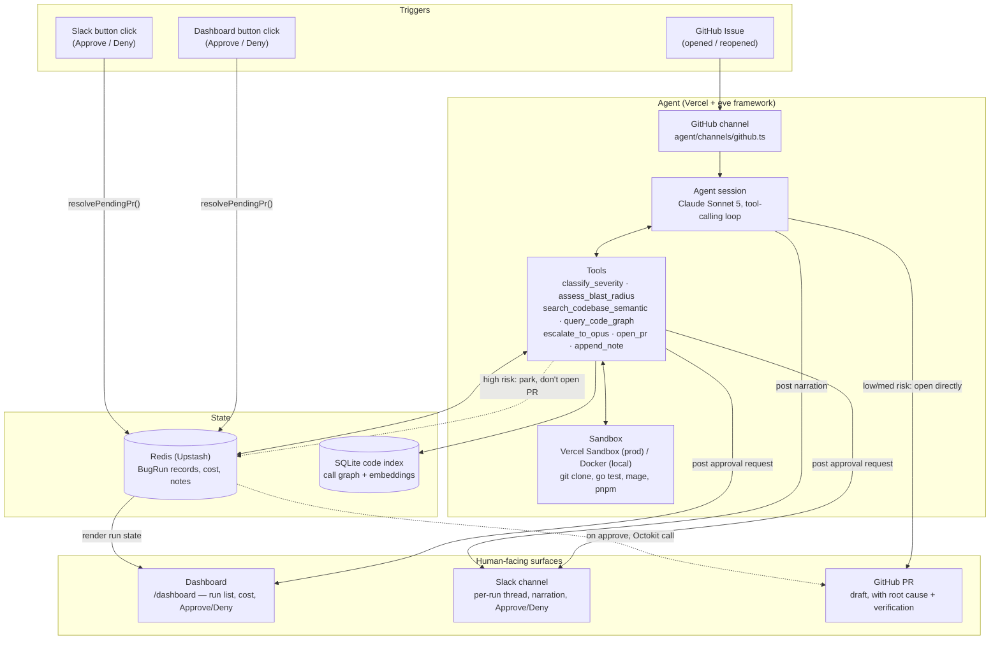
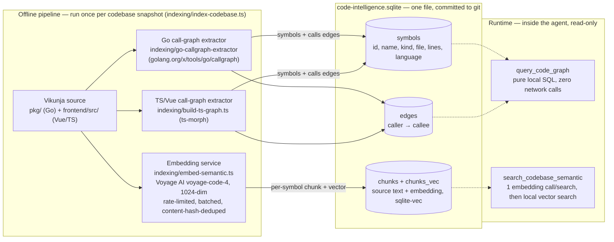
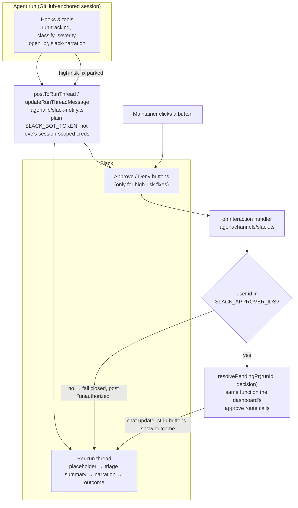
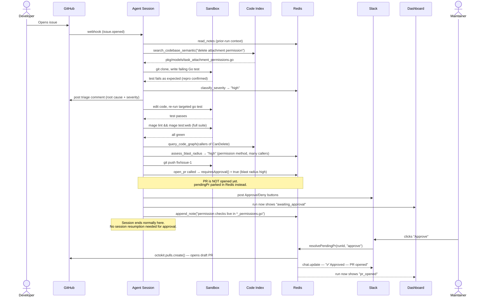
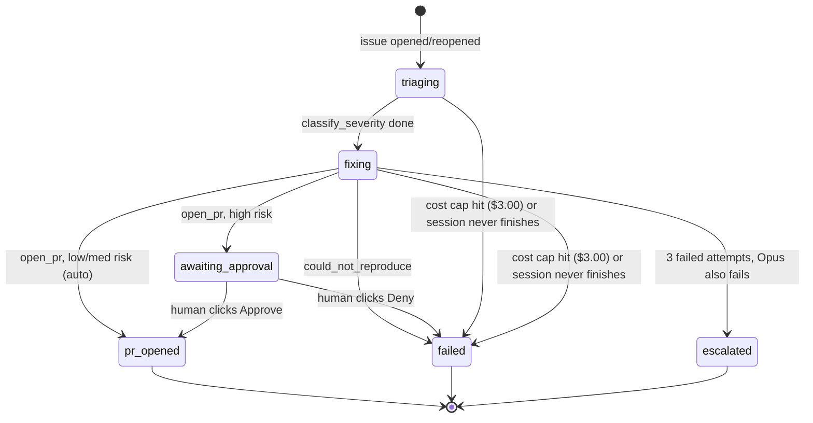
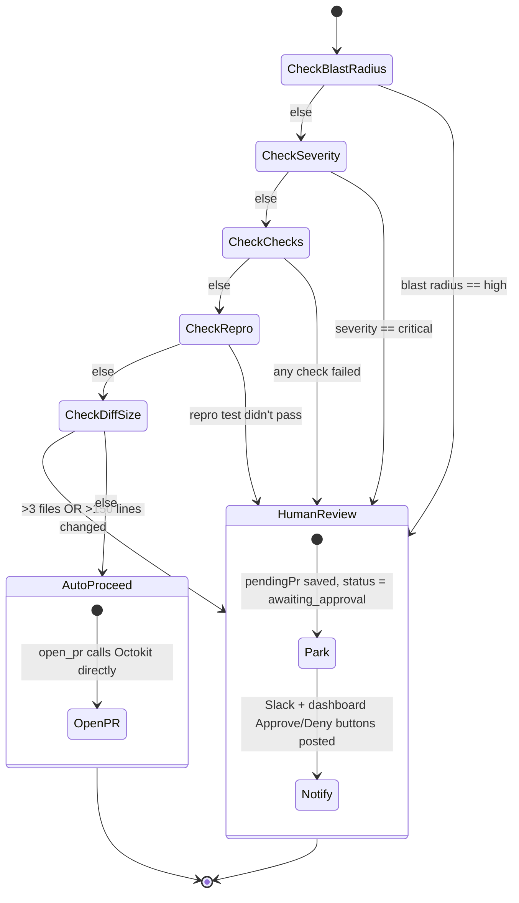
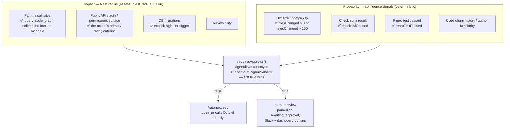

# Agentic Bug Triage & Resolution — How This Works

This is the human-readable design doc for the bug-triage-agent: what it does, how it's built,
the decisions behind it, and a direct answer to every question the assignment (`AI Director
Task.pdf`) evaluates against.

**Contents**
1. [What it does](#1-what-it-does-in-one-paragraph)
2. [System diagram](#2-system-diagram) — [2.1 Code intelligence index](#21-code-intelligence--the-index-layer-graph--semantic--embedding-service) · [2.2 Slack integration](#22-slack-integration)
3. [Sequence diagram — one bug, end to end](#3-sequence-diagram--one-bug-end-to-end)
4. [State machines — run lifecycle & the human-in-the-loop decision](#4-state-machines--run-lifecycle--the-human-in-the-loop-decision)
5. [How it works, phase by phase](#5-how-it-works-phase-by-phase)
6. [Design decisions, and why](#6-design-decisions-and-why)
7. [Answering the evaluation directly](#7-answering-the-evaluation-directly)
8. [What I'd build with more time](#8-what-id-build-with-more-time)
9. [Human-readable vs. internal](#9-whats-human-readable-and-what-deliberately-isnt)

---

## 1. What it does, in one paragraph

A GitHub issue is opened against a fork of [Vikunja](https://vikunja.io) (Go backend, Vue
frontend). A webhook wakes the agent, which reads the issue, searches the codebase semantically
to find the relevant code, writes a failing test that reproduces the bug, classifies its
severity, fixes it, verifies the fix with the full test/lint suite, and opens a draft PR — all
without a human touching it, *unless* the fix is high-risk, in which case it stops short of
opening the PR and asks a human to approve or deny it, over Slack and a dashboard. Every run's
cost, tokens, and outcome are tracked; every run leaves behind a note for the next one.

**How it was planned:** this wasn't built by improvising against the codebase. It's three
brainstorm → spec → plan cycles, in this order, each committed to `docs/superpowers/`:

1. [`2026-08-19-agentic-bug-triage-design.md`](docs/superpowers/specs/2026-08-19-agentic-bug-triage-design.md)
   / [`-plan.md`](docs/superpowers/plans/2026-08-19-agentic-bug-triage.md) — the base agent
   itself: triage, fix, autonomy gate, cost tracking.
2. [`2026-08-20-code-intelligence-design.md`](docs/superpowers/specs/2026-08-20-code-intelligence-design.md)
   / [`-plan.md`](docs/superpowers/plans/2026-08-20-code-intelligence.md) — the index layer
   (§2.2).
3. [`2026-08-21-slack-integration-design.md`](docs/superpowers/specs/2026-08-21-slack-integration-design.md)
   / [`-plan.md`](docs/superpowers/plans/2026-08-21-slack-integration-plan.md) — Slack (§2.3).

Each plan was then executed task-by-task with a fresh implementer + reviewer subagent pair per
task (Superpowers' subagent-driven-development), not one long freeform session — which is why
the codebase reads the way it does: every non-obvious line has a comment naming the constraint
or bug that produced it, because that's what a task reviewer actually checked for.

**Model tier per task.** subagent-driven-development's own rule is "least powerful model that
can handle the role" — a fully-specified, 1–2-file task is transcription-plus-testing (cheap
tier); a task needing multi-file integration judgment gets the standard tier; architecture-
level or live-debugging work gets the most capable tier. The tables below apply that same
rule to each task's actual scope (below, from the file-touch counts and nature of each task in
the plan documents themselves — the literal per-dispatch log lived in a git-ignored scratch
workspace that gets deleted once a plan's final review is clean, so this reconstructs the
*intended* tier from the plan, not a replayed log):

**Plan 1 — Agentic Bug Triage** (`2026-08-19-agentic-bug-triage.md`, 17 tasks)

| Task | Recommended tier | Why |
|---|---|---|
| 1. Fork Vikunja, repoint local clone | Haiku | Pure git/config mechanics, no judgment. |
| 2. Seed the backend bug | Sonnet | Writing a *convincing, subtle* auth bug needs real understanding of the permission model. |
| 3. Seed the frontend bug | Sonnet | Same — a subtle, plausible date-range default bug, not a typo. |
| 4. File the two demo GitHub issues | Haiku | Templated issue text from already-decided bug descriptions. |
| 5. Scaffold the eve project | Sonnet | New framework conventions, several interacting files. |
| 6. Sandbox bootstrap (clone Vikunja fork) | Sonnet | Sandbox lifecycle hooks, UID/checkout edge cases. |
| 7. Autonomy override function (pure, unit-tested) | Haiku | Fully-specified pure function + tests, 1 file. |
| 8. Bug-run store (Redis-backed) | Sonnet | Atomic Lua-script design to close a real race condition. |
| 9. Cost-tracking hook | Sonnet | Integrates with eve's step-event lifecycle; field-mapping correctness matters. |
| 10. `classify_severity` tool | Sonnet | New tool wiring across schema/store/prompt, 3 files. |
| 11. `assess_blast_radius` tool | Haiku | Mirrors Task 10's established pattern, single file. |
| 12. `escalate_to_opus` tool | Sonnet | Novel fallback-escalation logic, no prior pattern to copy. |
| 13. Cross-bug memory tools + could-not-reproduce outcome | Sonnet | Three new files, cross-cutting store changes. |
| 14. `open_pr` tool (approval-gated) | Opus | The core autonomy-gate decision point — architecturally load-bearing. |
| 15. GitHub channel wiring + `instructions.md` | Sonnet | Integration with eve's channel API, prompt-engineering judgment. |
| 16. Dashboard channel | Sonnet | New HTTP channel: routing, rendering, multiple concerns. |
| 17. Provision, deploy, verify end-to-end | Opus | Live debugging against real infra — this is where the prompt-cache and cost-cap bugs were actually found. |

**Plan 2 — Code Intelligence** (`2026-08-20-code-intelligence.md`, 8 tasks)

| Task | Recommended tier | Why |
|---|---|---|
| 1. Shared schema module + DB helpers | Haiku | Schema is fully specified in the plan; transcription + tests. |
| 2. Go call-graph extractor | Opus | `go/callgraph` package internals, non-obvious API, standalone Go module. |
| 3. TS/JS/Vue graph extractor (ts-morph) | Sonnet | Established pattern from Task 2, different AST library. |
| 4. Semantic chunk embedding | Sonnet | Voyage API integration, rate-limiting/batching edge cases (see §2.1). |
| 5. `query_code_graph` tool | Sonnet | SQL query design, the ambiguous-symbol-name edge case. |
| 6. `search_codebase_semantic` tool | Haiku | Follows Task 5's established tool-wiring pattern closely. |
| 7. Indexing orchestrator + `instructions.md` wiring | Sonnet | Glues Tasks 2–6 together; ordering and error-handling judgment. |
| 8. Build the real index, verify end-to-end | Opus | Live run against the real Vikunja tree; where the char-limit/rate-limit tuning happened. |

**Plan 3 — Slack Integration** (`2026-08-21-slack-integration-plan.md`, 6 tasks)

| Task | Recommended tier | Why |
|---|---|---|
| 1. Extract `resolvePendingPr()` | Sonnet | Pure refactor, but must not change dashboard behavior — correctness-sensitive. |
| 2. `slack-notify.ts` helper + store fields | Haiku | Small, single-purpose helper mirroring an existing pattern (`GITHUB_PR_TOKEN`). |
| 3. Slack channel + Approve/Deny buttons | Opus | The architectural fix for eve's session-scoping wall (§6) — highest-judgment task in the plan. |
| 4. Wire Slack posts into existing hooks/tools | Sonnet | Touches 3 existing files without breaking their current behavior. |
| 5. Mirror agent narration into Slack | Haiku | One small hook, narrow scope. |
| 6. Live end-to-end verification | Opus | Where the duplicate-`action_id` and uncaught-Octokit bugs were actually found live. |

---

## 2. System diagram

**Why it's shaped this way:** the agent itself only ever talks to Redis, the sandbox, and the
code index. Approval decisions never resume the agent's session — they're resolved by a plain
REST call (`resolvePendingPr`) that either of the two human-facing surfaces can trigger. That
split is the single most load-bearing decision in this system; §6 explains why.

### 2.1 Code intelligence — the index layer (graph + semantic + embedding service)

Built as its own offline pipeline (`indexing/`), separate from the deployed agent, and
committed as one artifact the agent reads at runtime with zero external calls on the graph
side and one small API call on the semantic side:

Two tools, two different jobs, and neither one substitutes for the other. Semantic search
answers *"where in this huge codebase is the code for X"* — the first call every triage phase
makes, replacing grep-archaeology. The call graph answers a question embeddings structurally
can't: *"who calls this function"* — which is what blast-radius actually depends on
(`CanDelete` is implemented on ~23 different types in Vikunja; a similarity search can't tell
you which callers matter, but a real graph edge can). Both read from the same SQLite file,
built once offline and shipped as a bundled read-only asset, so a live triage run never waits
on an indexing job — it only ever queries.

### 2.2 Slack integration

Slack is a notification + approval surface, deliberately *not* a second conversational agent —
the agent's one live session per run stays anchored to GitHub the entire time; Slack never
tries to resume it:

Every message is best-effort — a Slack outage never breaks triage or fix work, matching the
same non-fatal pattern already used for GitHub comments and Redis writes elsewhere in the
codebase. The authorization check fails closed both ways: an empty allowlist denies everyone
(loudly, as a misconfiguration), and a user not on the list is denied and told so — a fix that
touches auth code shouldn't be approvable by whoever happens to be in the channel.

---

## 3. Sequence diagram — one bug, end to end

This is the actual path issue `#1` (task-attachment permission bug, backend, high blast
radius) took, including the human-in-the-loop branch:

---

## 4. State machines — run lifecycle & the human-in-the-loop decision

### 4.1 Run lifecycle — what a run goes through

The `status` field (`triaging` / `fixing` / `awaiting_approval` / `pr_opened` / `escalated` /
`failed`) is the coarse state. `outcome` (`auto_resolved` / `escalated` / `could_not_reproduce`
/ `timed_out` / `cancelled` / `cost_capped` / `denied`) is the *reason* a terminal state was
reached, and is what the dashboard and Slack actually show a human — "denied" and "timed out"
both land on `status: failed`, but they mean very different things to a maintainer reading the
run list.

One rule worth calling out because it was a real bug once: `awaiting_approval` is deliberately
excluded from the "session ended without finishing, mark it failed" cleanup
(`shouldMarkIncomplete` in `agent/hooks/run-tracking.ts`). A parked approval *is* the session
ending normally — the human decision happens later, independent of the session. Sweeping it
into `failed` would silently kill the dashboard's Approve/Deny panel while the PR was still
fully approvable.

### 4.2 The human-in-the-loop decision — does *this* fix need a person?

This is `requiresApproval()` (`agent/lib/autonomy.ts`) itself, drawn as the sequence of checks
it actually runs — first match wins, no scoring, no averaging. §6 has the *conceptual* risk
model (impact × probability) this implements; this is the literal decision path:

The check order matters in practice: a `blastRadiusTier` of `"high"` short-circuits everything
else — a perfect diff with all checks green still stops at `CheckBlastRadius` and never reaches
`CheckDiffSize`. That's intentional (§6's "single unambiguous trigger" point), not a gap.

---

## 5. How it works, phase by phase

The agent's entire behavior is a single instructions document
(`agent/instructions.md`) the model follows every run — there's no separate orchestration
code deciding "now do step 2." Four phases:

**0. Load prior context** — `read_notes` first, always. Returns every note left by earlier
runs (see §6, cross-bug memory).

**1. Triage (read-only)** — `search_codebase_semantic` *before* any manual `grep`/`glob`
exploration (the semantic index exists specifically to replace that). Write a failing test
that reproduces the bug — a Go test for backend, a Vitest test for frontend. If it can't be
reproduced after a reasonable effort, call `report_could_not_reproduce` and stop — the agent
is explicitly told not to guess at fixes for bugs it can't confirm. Identify root cause, call
`classify_severity` (Haiku — cheap, and severity classification doesn't need a strong model),
post the triage findings as an issue comment.

**2. Solve (only if phase 1 reproduced the bug)** — branch, edit code until the repro test
passes (fast, targeted `go test ./pkg/<package> -run <Name>`, not a full-tree rebuild every
iteration), run the full check suite once. Three failed attempts escalate to Opus
(`escalate_to_opus`) for a second opinion, then the agent applies its suggestion itself. Once
green, call `query_code_graph` for every changed function's callers, feed that into
`assess_blast_radius` (Haiku again), push the branch, call `open_pr` with the diff stats,
severity, blast radius, and check results.

**3. Always, at the end** — `append_note` with one concrete fact learned this run, whether or
not the bug was fixed.

`open_pr` is where autonomy is actually decided (see §6) — it's a deterministic function, not
a model judgment call, that either opens the PR immediately via Octokit or parks it in Redis
and posts an Approve/Deny message to Slack and the dashboard.

---

## 6. Design decisions, and why

**Deterministic autonomy override, not model self-assessment.**
`requiresApproval()` (`agent/lib/autonomy.ts`) is a plain function: blast radius high, OR
severity critical, OR any check failed, OR the repro test didn't pass, OR more than 3 files /
150 lines changed → human approval required, no exceptions. The model's own severity/blast-
radius judgment feeds this function as *input*, but the gate itself can't be reasoned around
by the model having a good day. Risk gates should be code, not vibes — the function's own
comment names the shape it's implementing: "risk = impact × probability, with a forced
override for the unambiguous cases."

This is the conceptual risk model behind the gate, mapped honestly against what's actually
implemented (✅) versus what the framework names but this system doesn't track. Two gaps are
worth calling out rather than papering over: **reversibility** isn't scored separately — every
auto-opened PR is a *draft*, which is the system's actual answer to reversibility (nothing
merges without a further human action, regardless of tier) rather than a distinct signal.
**Code churn history / author familiarity** don't apply here at all — the "author" is always
this agent, with no notion of *this* agent being more or less trusted over time yet (§8's
"success-rate tracking" is the natural place that would eventually feed back into this). There
is also no continuous score in the current build — every ✅ signal is a hard boolean OR, not a
weighted sum, which is a deliberate simplification (see the "Deterministic..." point above)
rather than an oversight: a single unambiguous trigger (e.g. touches auth) is treated as
disqualifying on its own, not averaged away by four unrelated low-risk signals.

**Approval is resolved outside the agent's session, on purpose.**
The obvious design is eve's built-in tool-approval HITL: pause the session, wait for a human
reply, resume. That's the *first* thing tried here, and it doesn't work for this shape of
system — eve scopes session resumption strictly to the channel that owns the session (GitHub,
here), confirmed by three different failed approaches all hitting the same
`RuntimeNoActiveSessionError`. A GitHub-anchored session can't be resumed from a Slack
button click. The fix: stop treating "open the PR" as something that needs the agent's session
alive at all. It's a REST call. `open_pr` parks a `PendingPr` record in Redis and lets the
turn end normally; `resolvePendingPr` — callable from Slack's `onInteraction` or the
dashboard's approve route, with no session involved — does the actual `octokit.pulls.create()`
later, whenever a human gets to it (minutes or days later, doesn't matter).

**Cost cap, not time cap, as the proactive kill switch.**
Real data from three early runs: each one burned its *entire* time budget without ever
reaching `open_pr` — 100% waste, 3/3. A wall-clock timeout kills a run that's still doing
legitimate work just as readily as one that's stuck. Cost is the fairer signal: a cache-heavy
run doing real work can safely run long; a run burning fresh tokens fast should stop sooner
regardless of the clock. `run-tracking.ts` caps at $3.00/run and lets the session's own
24-hour timeout (long enough for a human to actually see and act on a Slack message) be the
last-resort backstop, not something actively raced against.

**Two-tier codebase memory: an index, and a notes log.**
"Understanding the codebase" is split into two different problems with two different
mechanisms. *Within* a run: `search_codebase_semantic` (Voyage embeddings over chunked
source) finds the relevant code without grep-archaeology, and `query_code_graph` (a real
call-graph extracted from the Go and TS/Vue source) answers "who calls this function" — the
question that actually determines blast radius, and one embeddings alone can't answer
reliably. *Across* runs: `append_note`/`read_notes` is a flat Redis list of one-line facts
("permission checks live in `*_permissions.go`, not the route handlers") that every run reads
first and adds to last. Bug #2 genuinely does get triaged faster because of a note left while
fixing bug #1 — this is the direct answer to "does solving bug #1 help solve bug #2."

**Model tiering by task, not by default.**
Haiku for `classify_severity` and `assess_blast_radius` (classification, not reasoning-heavy),
Sonnet for the actual fix loop, Opus only as an escalation after 3 failed fix attempts. This
isn't a cost-cutting afterthought — it's the assignment's own instruction ("use Haiku for
development... Sonnet/Opus only when you need the extra reasoning power") applied literally to
the runtime, not just to how the agent itself was built.

**Sandbox split: Docker locally, Vercel Sandbox in production — and they are not the same
image.** This bit for real: an earlier fix added a Go toolchain to the *local* Docker image
(`sandbox.Dockerfile`) and assumed that covered "the sandbox." It didn't — Vercel Sandbox
can't boot from a custom image at all (confirmed in eve's own type definitions: `runtime` is
excluded from what you're allowed to override), so production had no Go toolchain, and
separately, Vikunja's `go-sqlite3` dependency needs a C compiler or Go silently builds a stub
instead of erroring — meaning even a working `go` binary couldn't produce a meaningful pass or
fail. Production's fix is a `bootstrap` hook in `agent/sandbox/sandbox.ts` that installs Go,
`mage`, and `gcc` directly into the Vercel sandbox template. Two backends means two things to
keep in sync, and it's worth naming that as a real limitation, not just a fixed bug — see §8.

**Prompt caching, tuned for how this agent actually runs.**
Model calls in a fix loop are routinely separated by sandbox commands that outlive Anthropic's
default 5-minute cache window (`mage test:web` alone can run minutes). A middleware
(`agent/agent.ts`) upgrades every cache breakpoint eve sets to the 1-hour TTL, so a 40–70K
token system-prompt-plus-codebase-context prefix gets read back at 0.1x instead of paying the
fresh-token rate on every step. Costs more per cache write (2x vs 1.25x base) but that's
pennies against the dollars a cold prefix would cost every single step.

---

## 7. Answering the evaluation directly

*(from `AI Director Task.pdf` — "What We'll Evaluate")*

**Functionality — does it work end to end?**
Yes, demonstrated against two introduced bugs in the Vikunja fork:
- **Backend** (issue #1): any project member with read-only access could delete other users'
  task attachments — a missing permission check in `pkg/models/task_attachment_permissions.go`.
  High severity, high blast radius → routed to human approval.
- **Frontend** (issue #2): the "Upcoming Tasks" view defaulted to showing only tomorrow's
  tasks instead of the next 7 days when opened without a date range in the URL. Lower blast
  radius → resolved and PR opened automatically, no human step.

Both went from GitHub issue → reproduced → root-caused → fixed → verified → PR, live, on the
deployed agent (see the video walkthrough for the actual run).

**Autonomy level — appropriate to risk?**
The frontend date-range bug never involved a human: 3 files, ~40 lines, low blast radius, all
checks passed — `requiresApproval()` returns false and the PR opens on its own. The backend
permission bug touches an authorization check with ~23 implementing types and real callers
across the codebase — `requiresApproval()` forces a stop regardless of how confident the model
sounds. That's the intended shape: autonomy is earned by low-risk changes, not by how the fix
*looks*.

**Human-in-the-loop — informed at critical decision points, clear escalation?**
Every run posts to a per-issue Slack thread as it progresses (triage findings, the approval
request itself when one is needed, and the final outcome) via `postToRunThread` — a maintainer
watching Slack sees the reasoning, not just a final ping. The dashboard mirrors the same state
for anyone not in Slack. The escalation path is two-layered: model-level (3 failed fix
attempts → Opus gets a second look with the full attempt history) and risk-level (anything
matching `requiresApproval()` stops short of the PR and waits for an explicit human decision,
with Approve/Deny available from either surface, gated by a Slack-side approver allowlist so
not just anyone in the channel can approve production changes).

**Measurement — how do you know this is working?**
The dashboard tracks, per run: total cost, wall-clock elapsed time, fresh vs. cache-discounted
token counts, and the terminal outcome (`auto_resolved` / `escalated` / `could_not_reproduce`
/ `denied` / `cost_capped` / ...). Across runs, a running "spend this session / cap" budget bar
makes cost trend visible at a glance, not just per-run. The intent isn't a full analytics
suite — it's the smallest set of numbers that answers "is this run worth its cost" and "is the
system as a whole staying inside budget."

**Context & memory management — does solving bug #1 help bug #2?**
Concretely yes, via two different mechanisms (detailed in §6): the semantic/call-graph index
means the agent never re-derives "where is this code" from scratch, and the notes log means a
gotcha discovered fixing one bug (a file location, a non-obvious pattern) is available,
verbatim, the next time any bug touches nearby code — without re-paying the tokens to
rediscover it.

**Taste — useful, or just impressive?**
The test of "would a developer mute this after a day" is why the dashboard and Slack messages
show *reasoning* (root cause, severity rationale, blast-radius rationale, what changed) instead
of just a status pill — and why the autonomy gate is conservative by default (blast-radius
`high` or severity `critical` always stops, no override). A tool that silently merges its own
auth-code changes would get muted in a day for good reason; one that fixes what's obviously
safe and asks clearly for the rest is closer to something a team could actually run.

---

## 8. What I'd build with more time

*(from the submission write-up ask — "if you had a full month")*

- **A single sandbox definition, not two.** The Docker/Vercel split (§6) is a real
  maintenance cost — every environment change has to be made twice and can silently drift out
  of sync (as it did). Worth investigating whether `microsandbox` (works on Apple Silicon, the
  closest local match to hosted Vercel Sandbox per eve's own docs) collapses this to one
  definition.
- **A real regression suite for the agent itself**, not just the app it's fixing — a corpus of
  known bugs with expected outcomes (fixed automatically / escalated / correctly refused as
  unreproducible), run on every instructions.md or tool change, so a prompt tweak that quietly
  breaks triage accuracy is caught before it reaches a real GitHub issue.
- **Success-rate tracking, not just cost/time.** Today the dashboard shows what each run cost
  and how it ended; it doesn't yet answer "of the last 20 auto-resolved PRs, how many actually
  got merged as-is by a human reviewer" — the real ground truth for whether the autonomy
  threshold is calibrated correctly.
- **Per-repo tuning of the autonomy gate.** `requiresApproval()`'s thresholds (3 files, 150
  lines) are reasonable defaults for one mid-size Go/Vue app; a real deployment across
  multiple repos would want those calibrated per-repo, possibly per-directory (touching
  `pkg/auth/` should always require approval regardless of line count, for instance).
- **Multi-turn human feedback on a denial**, not just approve/deny. Today a "Deny" ends the
  run with a comment; a maintainer who denies because the approach is wrong but the diagnosis
  is right currently has to re-file the issue rather than redirect the same run.

---

## 9. What's human-readable, and what deliberately isn't

**Human-facing, written in plain language on purpose:**
- Dashboard run list/detail — status, cost, outcome, in the same vocabulary a developer
  scanning a CI dashboard already knows.
- Slack thread per run — triage findings and the approval request, in prose, not JSON.
- The PR body itself — issue link, root cause, repro test, verification results, blast-radius
  rationale. This is the artifact a human reviewer actually reads.
- GitHub issue comments — the triage "routing decision" comment, posted before any code is
  touched, so a maintainer skimming the issue thread sees the reasoning even without opening
  Slack or the dashboard.

**Deliberately internal, never surfaced as-is:**
- Redis `BugRun` records and the Lua scripts that update them atomically — machine state,
  correctness-critical, meaningless to read directly (and not meant to be — the dashboard is
  the read layer over this).
- The SQLite code-intelligence index (symbols/edges/chunk embeddings) — a lookup structure,
  not a document; its value is entirely in what `query_code_graph` and
  `search_codebase_semantic` derive from it, not in the tables themselves.
- Per-model-call token/cost line items (`ModelCallRecord`) — rolled up into the dashboard's
  cost/token totals for a human; the raw per-call log exists for debugging cost anomalies, not
  for routine reading.
- Cache-control middleware internals, sandbox bootstrap shell commands — infrastructure that
  should be invisible when it's working, and is where an engineer looks *only* when something
  is broken.

The dividing line: anything a maintainer needs to decide something (approve a fix, trust a
severity call, understand why a run cost what it cost) is rendered in prose or a labeled
number. Anything that exists purely so the *next* tool call has correct state stays as
structured data with no obligation to be readable.
